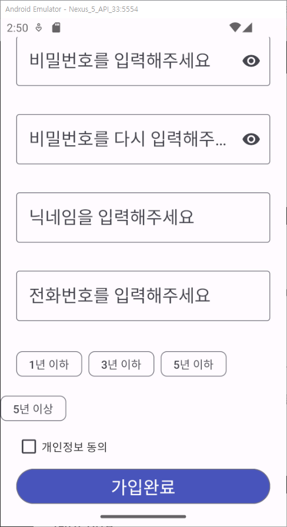
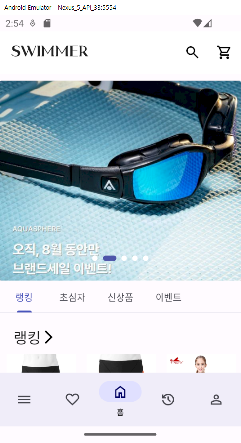

# FinalProject-ShoppingMallService-team3
테킷 앱스쿨:안드로이드1기 최종 프로젝트(쇼핑몰 서비스 개발) - 3팀
## 🩱 Swimmer

[//]: # (

)

## 📜 프로젝트 기획 의도
- 시장조사를 통해 시중에 있는 수영용품 쇼핑몰들의 장단점을 파악하여 기존 서비스들의 단점을 개선한, 사용자들에게 깔끔하고 사용하기 쉬운 수영용품 종합 쇼핑몰 앱을 개발하고자 합니다.

## 🌱 팀원 소개
🦁 : 리더  
🐯 : 부 리더  
🐹 : 팀원  

| Name   | Part        |Github|
|--------|-------------|---|
| 🦁 최가연 | android |[gayeon00](https://github.com/gayeon00)|
| 🐯 고진호 | android     |[wktkdandp](https://github.com/wktkdandp)|
| 🐹 이해현 | android     |[haehyun-lee](https://github.com/haehyun-lee)|
| 🐹 김진섭 | android     |[kimjinsub1217](https://github.com/kimjinsub1217)|
| 🐹 이지헌 | android     |[Jiheon-Lee98](https://github.com/Jiheon-Lee98)|
| 🐹 윤희서 | android     |[hailey-yoon10](https://github.com/hailey-yoon10)|

## 🗓️ 개발 기간
- 기획, 디자인, 설계 : 23년 8월 10일 ~ 23년 8월 16일
- 구현 : 23년 8월 17일 ~

## 🔨 기술 스택
- 개발 IDE : Android Studio
- 개발 언어 : Kotlin
- Architecture: MVVM
- 서버 : FireBase(Realtime Database, Storage)

## 📱 서비스 흐름 구조도

### 소비자용 서비스 구조도 

### 판매자용 서비스 구조도

## 🎮 주요 기능 설명
### 소비자용 서비스
1. 로그인 화면
- 이메일과 비밀번호를 입력할 수 있다.
- [로그인] 버튼을 누르면 로그인 처리가 이뤄진다.
- 아이디 저장, 자동 로그인을 체크할 수 있다.
- 아이디, 비밀번호 찾기를 할 수 있다.
- [회원가입] 버튼이 있다.

2. 회원가입 화면
- 아이디, 비밀번호, 비밀번호 확인 입력 칸이 있다.
- [아이디 중복 확인] 버튼을 클릭하면 중복되는 아이디가 있는지 체크한다.
- 수영 경험 유무와 경력
- 

3. 메인화면

### 판매자용 서비스