# FinalProject-ShoppingMallService-team3
테킷 앱스쿨:안드로이드1기 최종 프로젝트(쇼핑몰 서비스 개발) - 3팀
## 🩱 Swimmer

## 📜 프로젝트 기획 의도
- 시장조사를 통해 시중에 있는 수영용품 쇼핑몰들의 장단점을 파악하여 기존 서비스들의 단점을 개선한, 사용자들에게 깔끔하고 사용하기 쉬운 수영용품 종합 쇼핑몰 앱을 개발하고자 합니다.

## 🌱 팀원 소개
🦁 : 리더  
🐯 : 부 리더  
🐹 : 팀원  

| Name   | Part        |Github|
|--------|-------------|---|
| 🦁 최가연 | android |[gayeon00](https://github.com/gayeon00)|
| 🐯 고진호 | android     |[wktkdandp](https://github.com/wktkdandp)|
| 🐹 이해현 | android     |[haehyun-lee](https://github.com/haehyun-lee)|
| 🐹 김진섭 | android     |[kimjinsub1217](https://github.com/kimjinsub1217)|
| 🐹 이지헌 | android     |[Jiheon-Lee98](https://github.com/Jiheon-Lee98)|
| 🐹 윤희서 | android     |[hailey-yoon10](https://github.com/hailey-yoon10)|

## 🗓️ 개발 기간
- 기획, 디자인, 설계 : 23년 8월 10일 ~ 23년 8월 16일
- 구현 : 23년 8월 17일 ~

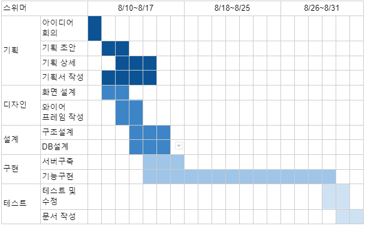

## 🔨 기술 스택
- 개발 IDE : Android Studio
- 개발 언어 : Kotlin
- Architecture: MVVM
- 서버 : FireBase(Realtime Database, Storage, authentication)

## 📱 서비스 흐름 구조도

### 소비자용 서비스 구조도 
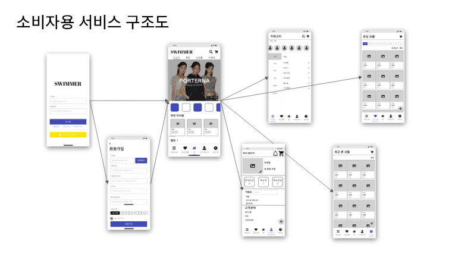
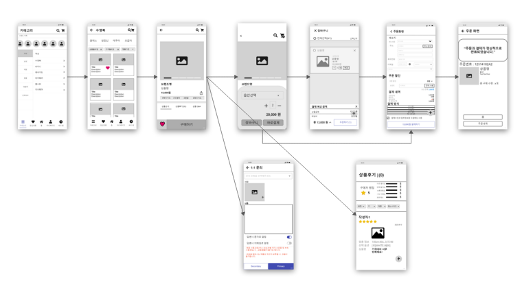

### 판매자용 서비스 구조도

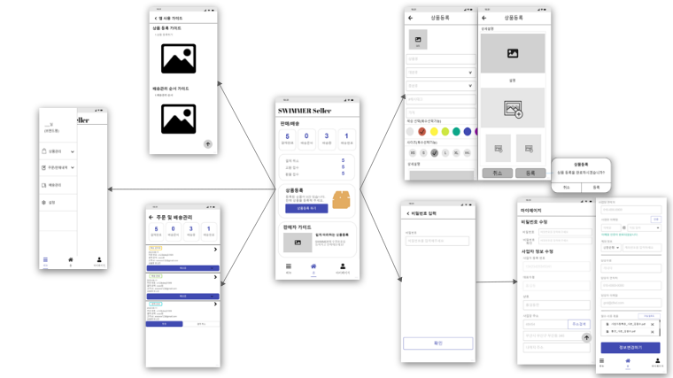

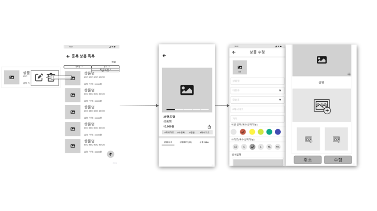

## 🎮 주요 기능 설명
### ⭐소비자용 서비스⭐

1. 메인화면
- 배너 이미지 - 기획전, 세일정보, 브랜드 이슈등이 보여진다.
- 랭킹, 초심자, 신상품, 이벤트 탭이 있다. (현재 랭킹탭만 구현)
- 판매자가 등록한 상품들이 보여진다.

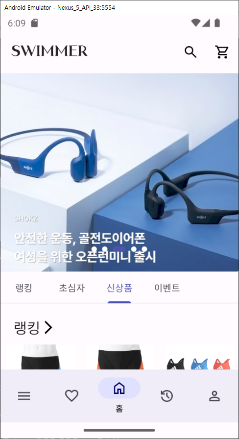
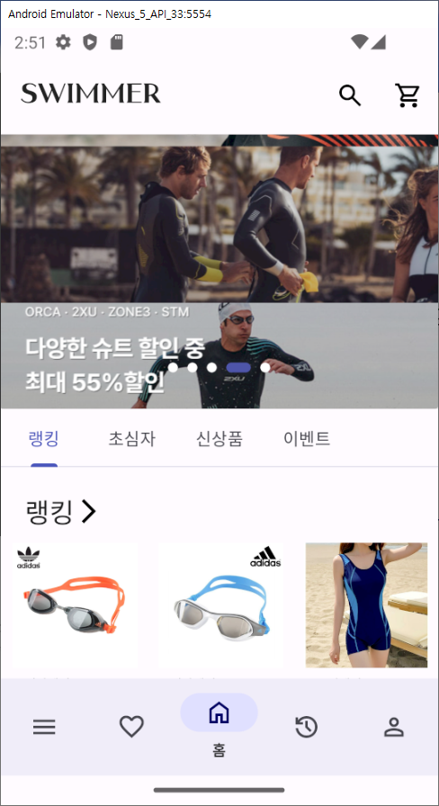

2. 상품 상세 화면
- 상품 이미지 가로 스크롤로 탐색
- 브랜드, 상품명, 가격 표시
- 해시태그
- 상품상세, 상품후기, 상품Q&A 탭을 클릭하면 각 화면을 표시한다.
- 상품설명, 상세 이미지 스크롤 뷰
- 구매하기 버튼
  - 구매하기 버튼을 누르면 옵션 선택
  - 옵션 선택시 선택 상품명, 수량, 가격 표시
  - 총 수량, 총 금액 표시

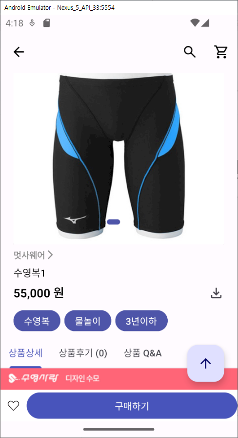

3. 주문 화면
- 배송지 선택하기 버튼을 누르면 배송지 목록이 뜨고, 배송지 추가도 가능하다. 목록 중 하나를 선택하면 배송지로 선택된다.
- 배송지 추가 받는 사람, 주소(우편번호(주소 검색), 나머지 주소)
- 배송 메모(리스트 다이얼로그로 몇 개 제공)
- 주문 상품 목록 표시 (상품명, 사이즈 , 색상, 가격 , 수량)
- 결제하기 버튼(총 금액 함께 보여주기)

4. 주문 완료
- “주문이 완료되었습니다.” 텍스트가 표시된다.
- 3초 뒤 홈 화면으로 이동합니다.

### ⭐판매자용 서비스⭐

1. 메인 화면
- 결제 완료, 배송 준비, 배송중, 배송 완료가 한눈에 보인다.
- 상품 등록 버튼을 누르면 상품을 등록할 수 있다.

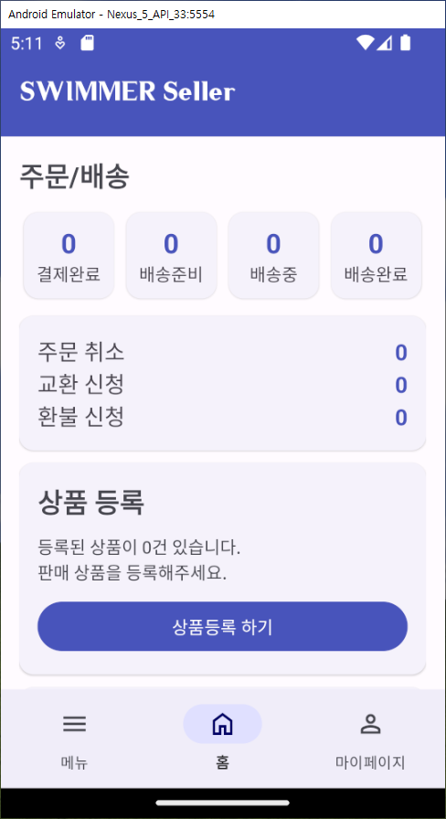

2. 상품 등록
- 상품 이미지를 최대 5개 등록할 수 있다.
- 상품명, 대분류, 중분류, 소분류, 해시태그, 가격, 상품 설명, 상품 설명 이미지를 입력받는다.
- 해시태그 선택 시 사용자 맞춤 추천 서비스에 이용된다.

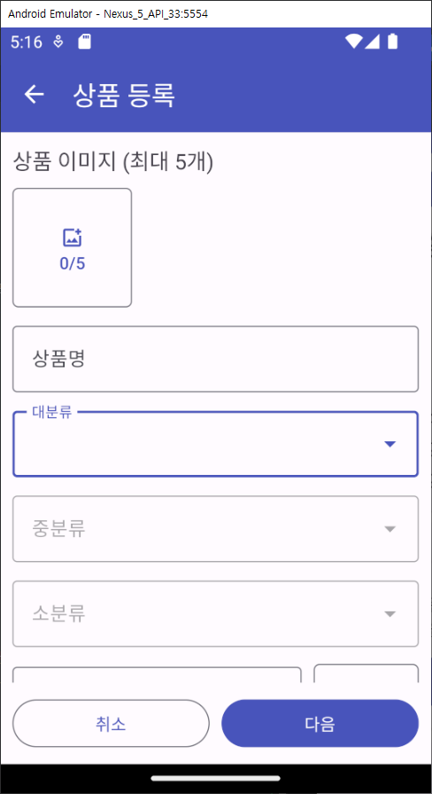
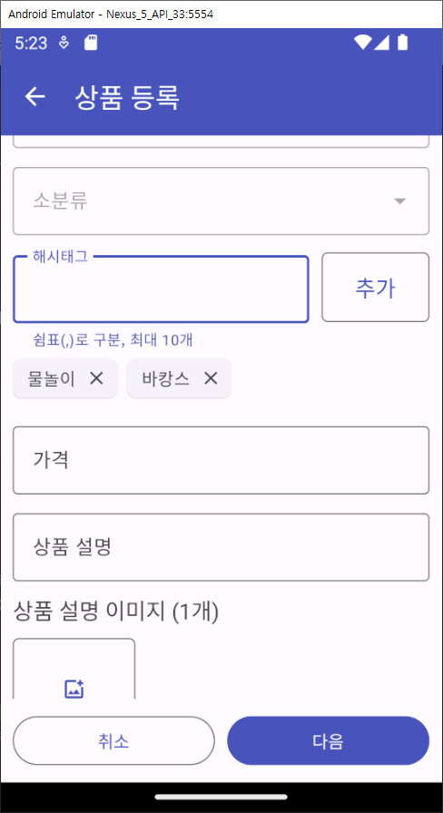

3. 상품 등록 옵션
- 옵션 추가를 클릭하면 색상과 사이즈를 추가할 수 있다.
- 상품 등록 버튼을 누르면 Snackbar를 띄워 상품 등록이 완료됐다고 알려준다.

